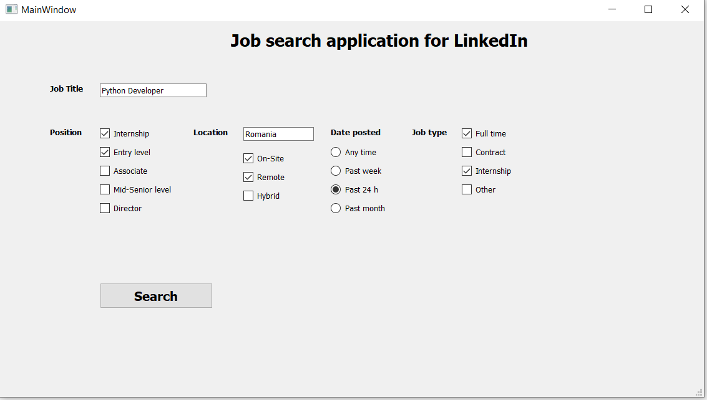
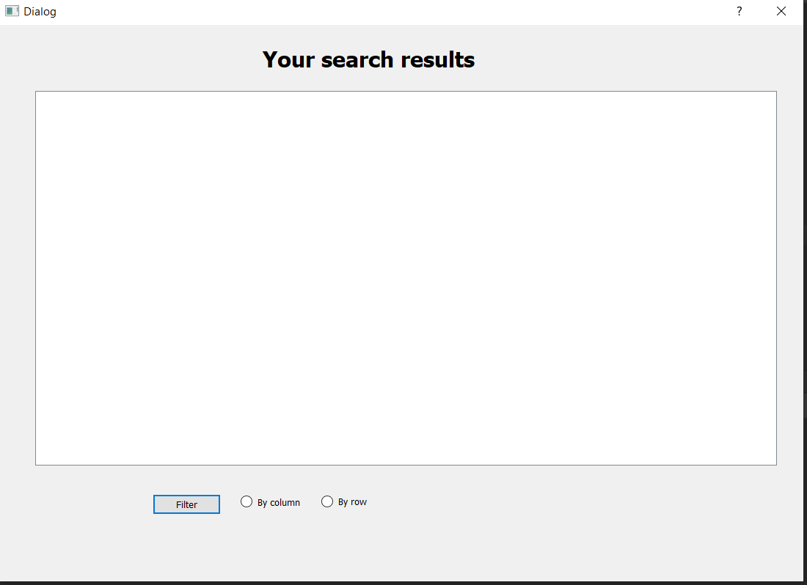
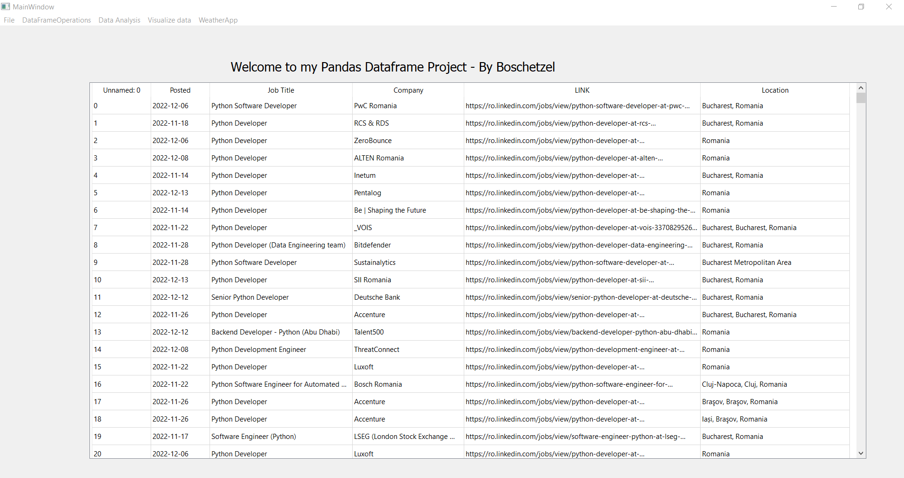

# JobSearchApplication 

- [About](#about)
- [Demo](#demo)
- [Usage](#usage)
- [Features](#features)
- [More Info](#more-info)

## About

The JobSearchApplication is a simple project for searching LinkedIn jobs based on a filter the user chooses.
After the user enters the filters in the GUI the results are saved in a *.csv file.

Note: the auto search in done without login credentials on LinkedIn website as web scrapping with an account 
is against LinkedIn TOS.

If you want to make changes to the *.csv file you can use my other project which can perform different operations on any *.csv : PandasDataFrame
https://github.com/Boschetzel/PandasDataFrame

Update : a GUI was implemented to view the results and allows user to filter them.

## Demo

## Usage

Main usage of this application is to auto search for jobs and store the info in a *.csv file for later use.
Packages needed for this application to run are available in the requirements.txt.

## Features
The JobSearchApplication allows the user to filter and search data based on the following criteria:
- Position 
    - internship
    - entry-level
    - associate
    - mid-senior level
    - director
- Location 
  - on-site
  - remote
  - hybrid
  
- Date Posted
  - any-time
  - past week
  - past month
  - past 24 h
  
- Job Type
  - full-time
  - contract
  - internship
  - other

## More info
**Issues, feedback and pull requests are welcome.**

Project's version is 0.1.1 and may be subject to further changes.

If you like this project remember to leave a ⭐! 

